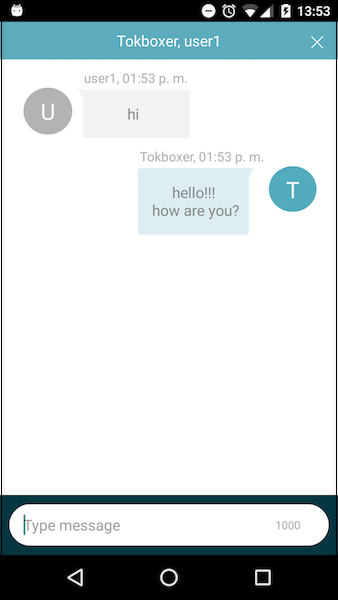

[](https://travis-ci.com/opentok/accelerator-textchat-android)

# Accelerator TextChat for Android<br/>Version 2.1.0

## Quick start

This section shows you how to use the accelerator textchat.

## Install

There are two options for installing the OpenTok Accelerator TextChat library:

  - [Using the repository](#using-the-repository)
  - [Using Maven](#using-maven)

**NOTE**: The Accelerator TextChat includes the [OpenTok Accelerator Core for Android](https://github.com/opentok/accelerator-core-android).

#### Using the repository

1. Clone the [OpenTok Accelerator TextChat repo](https://github.com/opentok/accelerator-textchat-android).
2. From the OpenTok Text Chat Sample app project, right-click the app name and select **New > Module > Import Gradle Project**.
3. Navigate to the directory in which you cloned **OpenTok Text Chat Accelerator Pack**, select **accelerator-textchat-android**, and click **Finish**.
4. Open the **build.gradle** file for the app and ensure the following line has been added to the `dependencies` section:
```
compile project(':accelerator-textchat-android')
```

#### Using Maven

<ol>

<li>Modify the <b>build.gradle</b> for your solution and add the following code snippet to the section labeled 'repositories’:

<code>
maven { url  "http://tokbox.bintray.com/maven" }
</code>

</li>

<li>Modify the <b>build.gradle</b> for your activity and add the following code snippet to the section labeled 'dependencies’:

<code>
compile 'com.opentok.android:opentok-accelerator-textchat:2.1.0'
</code>

</li>

</ol>

##  Exploring the code

The `TextChatFragment` class is the backbone of the text chat communication feature.

This class, which inherits from the [`android.support.v4.app.Fragment`](http://developer.android.com/intl/es/reference/android/support/v4/app/Fragment.html) class, sets up the text chat UI views and events, sets up session listeners, and defines a listener interface to monitor the changes.

```java
public class TextChatFragment extends Fragment implements SignalListener {
    . . .
}
```

The `TextChatListener` interface monitors state changes in the `TextChatFragment`, and defines the following methods:

```java
public interface TextChatListener {
  void onNewSentMessage(ChatMessage message);
  void onNewReceivedMessage(ChatMessage message);
  void onTextChatError(String error);
  void onClose();
}
```

### Initialization methods

The following `TextChatFragment` methods are used to initialize the app and provide basic information determining the behavior of the text chat functionality.

| Feature        | Methods  |
| ------------- | ------------- |
| Set the maximum chat text length.   | `setMaxTextLength()`  |
| Set the sender alias of the outgoing messages.  | `setSenderAlias()`  |
| Set the listener object to monitor state changes.   | `setListener()` |


For example, the following private method instantiates a `TextChatFragment` object:

```java
  OTAcceleratorSession mSession = new OTAcceleratorSession (context, sessionId, apikey);
  mSession.connect(token);

  //...

  private void initTextChatFragment() {
    mTextChatFragment = TextChatFragment.newInstance(mSession, apikey);
    getSupportFragmentManager().beginTransaction()
                .add(R.id.textchat_fragment_container, mTextChatFragment).commit();
    getSupportFragmentManager().executePendingTransactions();    
  }
```

This lines of code illustrates how to set the maximum message length to 1050 characters and set a new sender alias:

```java
  try {
    mTextChatFragment.setSenderAlias("Tokboxer");
    mTextChatFragment.setMaxTextLength(140);
    mTextChatFragment.setListener(this);
  } catch (Exception e) {
    e.printStackTrace();
  }
```

### Sending and receiving messages

By implementing the `TextChatFragment.TextChatListener` interface, the app can monitor both receiving and sending activity. For example, a message is successfully sent, or a message is sent with a code in the event of an error.

The method implementations shown below use the `ChatMessage` object to send and receive messages.

The `onNewSentMessage()` event is fired when a new individual `ChatMessage` is sent to other client connected to the OpenTok session. To send a `ChatMessage`, the `TextChatFragment` uses the [OpenTok signaling API](https://tokbox.com/developer/sdks/android/reference/com/opentok/android/Session.html#sendSignal(java.lang.String,%20java.lang.String)).

The `onNewReceivedMessage()` event is fired when a new `ChatMessage` is received from the other client.

```java
    @Override
    public void onNewSentMessage(ChatMessage message) {
        Log.i(LOG_TAG, "New sent message");
    }

    @Override
    public void onNewReceivedMessage(ChatMessage message) {
        Log.i(LOG_TAG, "New received message");
    }
```

### One to one sample app using the Accelerator TextChat with best-practices for [Android](https://github.com/opentok/textchat-acc-pack/tree/master/android) (https://github.com/opentok/textchat-acc-pack).


